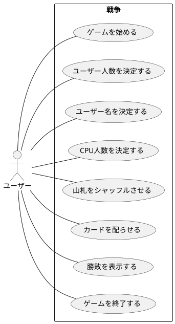
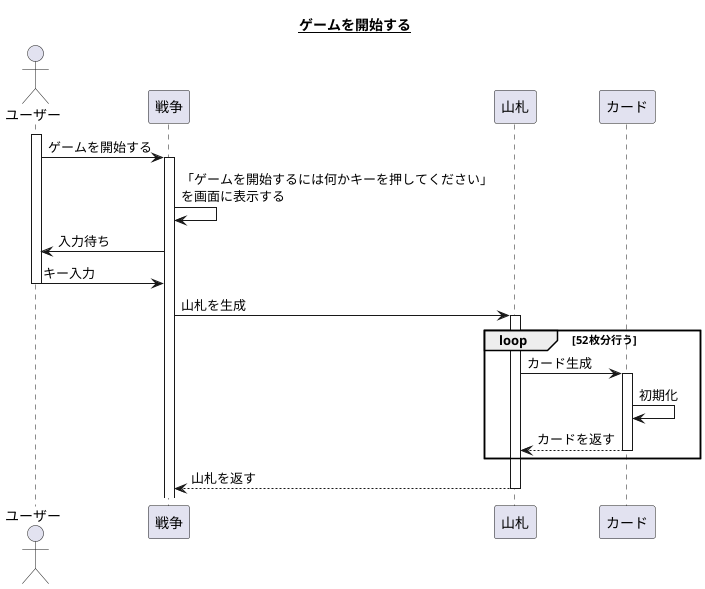
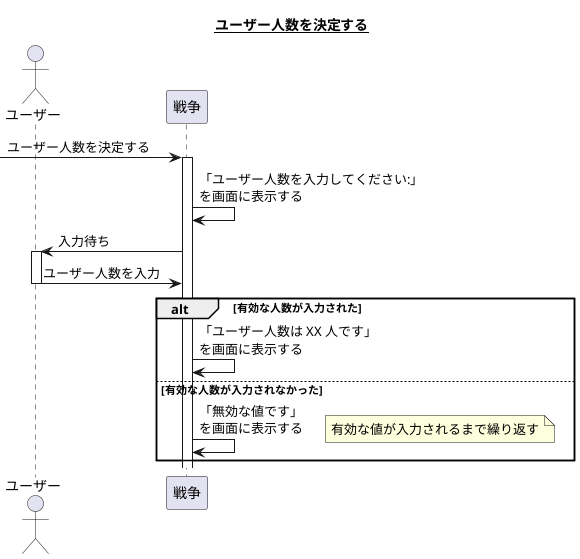
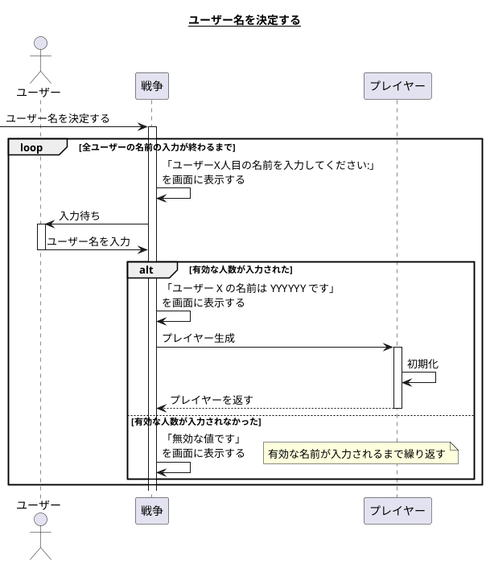
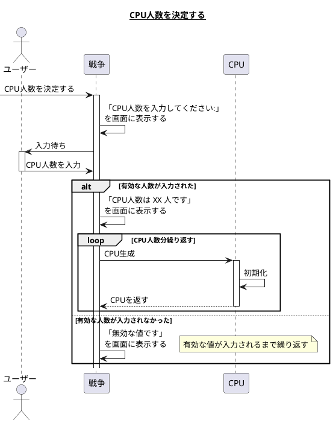
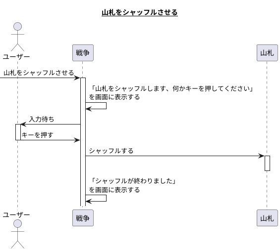
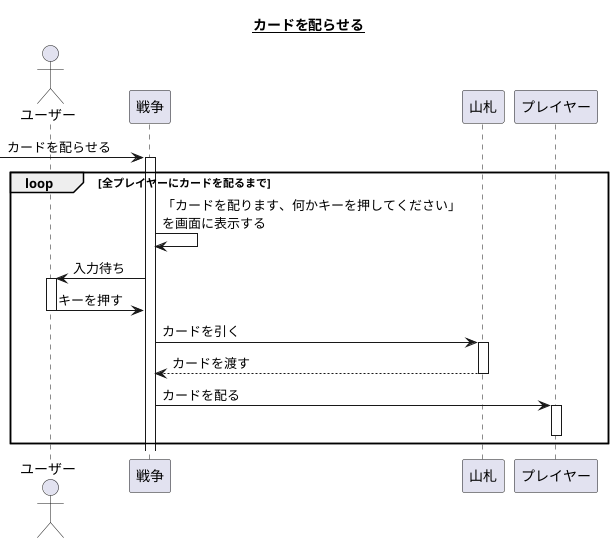
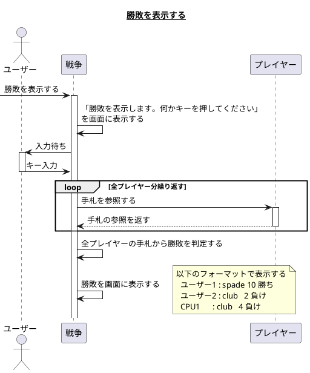
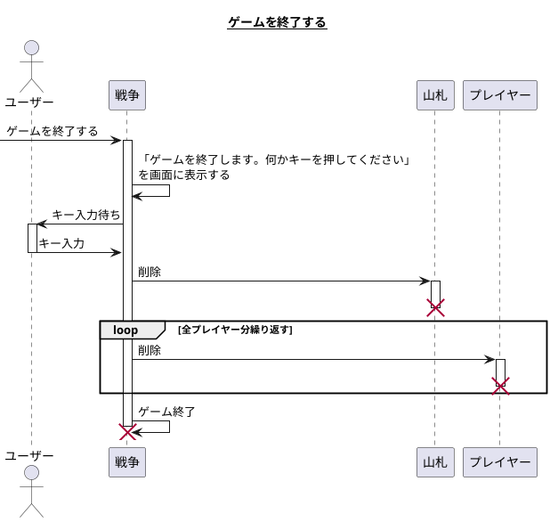
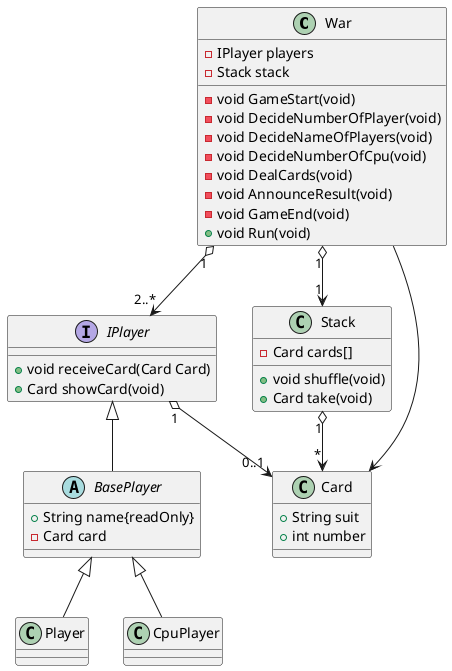

# カードゲームの設計書

## トランプゲーム 戦争

### 要求

- トランプはジョーカーを抜いた52枚で構成する。
- ユーザーとCPUの合計が2名以上で対戦する。
  - ユーザー、CPUをプレイヤーと呼ぶ。
- ゲーム開始時にユーザー人数と各ユーザー名を決める。
- ゲーム開始時にCPUの人数を決める。
- 各プレイヤーはお互いのカードを知ることは出来ない。
- システムが各プレイヤーにカードを1枚ずつ配る。
- 一番大きい数のカードを持つプレイヤーを勝利とする。
- 勝敗が決まったらプログラムを終了する。

### ユースケース

|     名称     |                                       ゲームを始める                                        |
| ------------ | ------------------------------------------------------------------------------------------- |
| 能動アクター | ユーザー                                                                                    |
| 受動アクター | なし                                                                                        |
| メインフロー | 1. 「ゲームを開始するには何かキーを押してください」というメッセージを表示し入力待ちにする。 |
|              | 2. ユーザーは何かキーを押す。                                                               |
| 例外フロー   | なし                                                                                        |

|     名称     |                                    ユーザー人数を決定する                                     |
| ------------ | ----------------------------------------------------------------------------------------------- |
| 能動アクター | ユーザー                                                                                        |
| 受動アクター | なし                                                                                            |
| メインフロー | 1. 「ユーザー人数を入力してください:」というメッセージを表示し入力待ちにする。                  |
|              | 2. ユーザーはユーザー人数を入力する。                                                           |
|              | 2. 「ユーザー人数は XX 人です」とメッセージを表示する。                                         |
| 例外フロー   | 入力値が0または53以上の場合、数値以外が含まれている場合は「無効な値です」と表示し再入力させる。 |

|     名称     |                               ユーザー名を決定する                                |
| ------------ | ----------------------------------------------------------------------------------- |
| 能動アクター | ユーザー                                                                            |
| 受動アクター | なし                                                                                |
| メインフロー | 1. 「ユーザーX人目の名前を入力してください:」というメッセージを表示し入力待ちにする。 |
|              | 2. ユーザーはユーザー名を入力する。                                                 |
|              | 2. 「ユーザーX人目の名前は YYYYYY です」とメッセージを表示する。                      |
| 例外フロー   | 入力文字列が0文字まはた21文字以上の場合は「無効な名前です」と表示し再入力させる。   |

|     名称     |                                                     CPU人数を決定する                                                     |
| ------------ | ------------------------------------------------------------------------------------------------------------------------- |
| 能動アクター | ユーザー                                                                                                                  |
| 受動アクター | なし                                                                                                                      |
| メインフロー | 1. 「CPU人数を入力してください:」というメッセージを表示し入力待ちにする。                                                 |
|              | 2. ユーザーはユーザー人数を入力する。                                                                                     |
|              | 2. 「CPU人数は XX 人です」とメッセージを表示する。                                                                   |
| 例外フロー   | 入力値とユーザー人数との合計が2未満または53以上の場合、数値以外が含まれている場合は「無効な値です」と表示し再入力させる。 |

|     名称     |                           山札をシャッフルさせる                            |
| ------------ | --------------------------------------------------------------------------- |
| 能動アクター | ユーザー                                                                    |
| 受動アクター | なし                                                                        |
| メインフロー | 1. 「山札をシャッフルします、何かキーを押してください」というメッセージを表示し入力待ちにする。       |
|              | 2. 何かキーを押す。                                                         |
|              | 2. 山札がシャッフルされ「シャッフルが終わりました」のメッセージを表示する。 |
| 例外フロー   | なし                                                                        |

|     名称     |                                                     カードを配らせる                                                     |
| ------------ | ------------------------------------------------------------------------------------------------------------------------ |
| 能動アクター | ユーザー                                                                                                                 |
| 受動アクター | なし                                                                                                                     |
| メインフロー | 1. 「カードを配ります、何かキーを押してください」とメッセージを表示し入力待ちにする。                                    |
|              | 2. システムがプレイヤー全員に1枚ずつカードを配る。                                                                       |
|              | 3. 「CPUがカードを引きました、お互いの手札を見せあいます。何かキーを押してください」とメッセージを表示し入力待ちにする。 |
| 例外フロー   | なし                                                                                                                     |

|     名称     |                                    勝敗を表示する                                     |
| ------------ | ------------------------------------------------------------------------------------- |
| 能動アクター | ユーザー                                                                              |
| 受動アクター | なし                                                                                  |
| メインフロー | 1. 「勝敗を表示します。何かキーを押してください」とメッセージを表示し入力待ちにする。 |
|              | 2. 何かキーを押す。                                                                   |
|              | 3. プレイヤー全員の手札から勝敗を判定する                                             |
|              | 4. 「プレイヤー名 : マーク 数値 [勝ち or 負け]」の表示を全プレイヤー分を表示する。           |
| 例外フロー   | なし                                                                                  |

|     名称     |                                    ゲームを終了する                                     |
| ------------ | --------------------------------------------------------------------------------------- |
| 能動アクター | ユーザー                                                                                |
| 受動アクター | なし                                                                                    |
| メインフロー | 1. 「ゲームを終了します。何かキーを押してください」とメッセージを表示し入力待ちにする。 |
|              | 2. 何かキーを押す。                                                                     |
|              | 3. プログラムを終了する                                                                 |
| 例外フロー   | なし                                                                                    |

### オブジェクト一覧

#### 候補

- ユーザー
- トランプ
- 戦争
- ゲーム
- メッセージ
- キー
- シャッフル
- 山札
- 引く
- プレイヤー
- CPU
- 数
- 手札
- 人数
- 名前

#### 抜擢

- ユーザー
- CPU
- カード
- 山札
- 戦争

### シーケンス図

### クラス図

