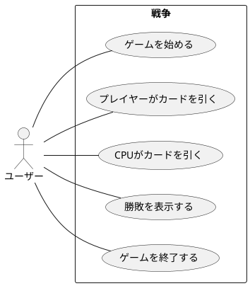
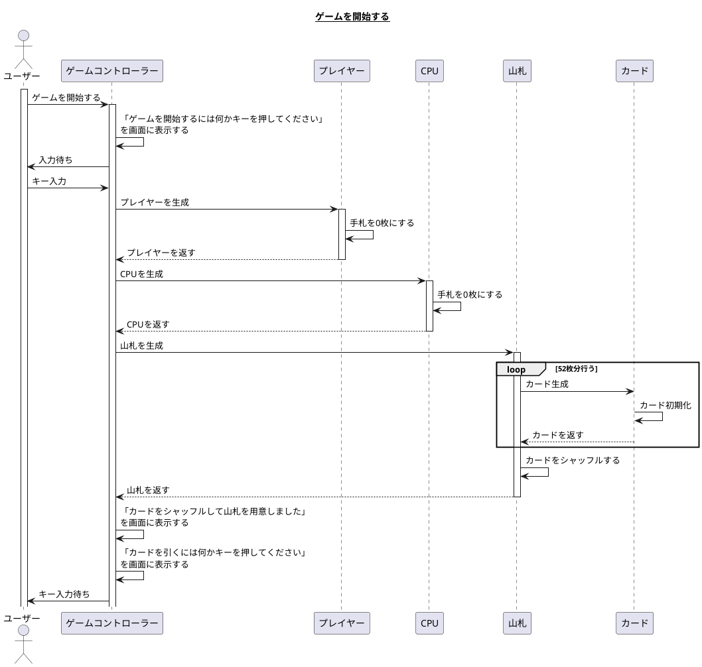
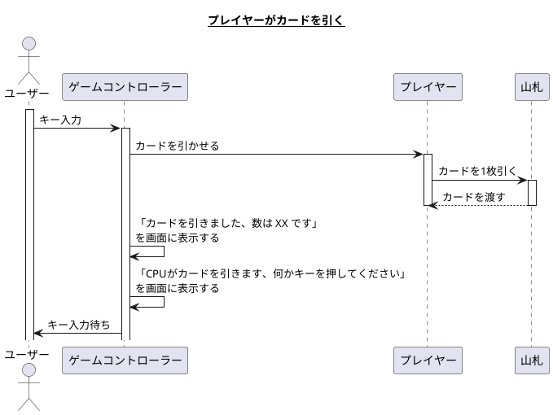
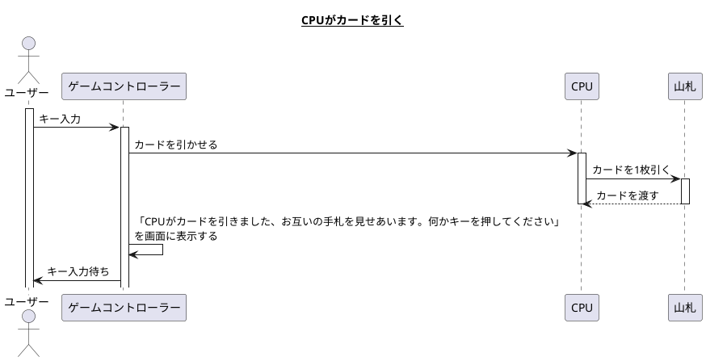
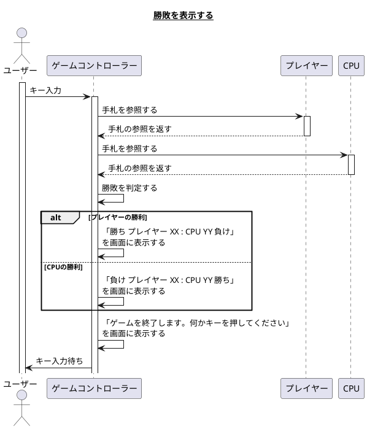
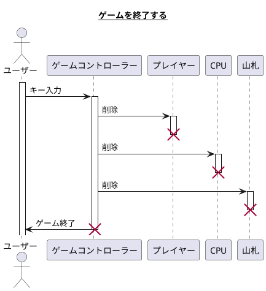
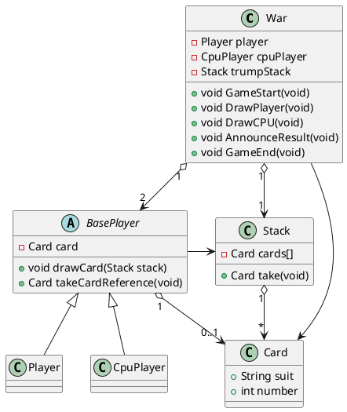

# カードゲームの設計書

## トランプゲーム 戦争

### 要求

- トランプはジョーカーを抜いた52枚で構成する。
- ユーザーとCPUの2名で対戦する。
- 2名はお互いのカードを知ることは出来ない。
- 2名はカードを1枚ずつ引き数の大きい方を勝利とする。
- 勝敗が決まったらプログラムを終了する。

### ユースケース

|     名称     |                                       ゲームを始める                                        |
| ------------ | ------------------------------------------------------------------------------------------- |
| 能動アクター | ユーザー                                                                                    |
| 受動アクター | なし                                                                                        |
| メインフロー | 1. 「ゲームを開始するには何かキーを押してください」というメッセージを表示し入力待ちにする。 |
|              | 2. ユーザーは何かキーを押す。                                                               |
|              | 3. カードをシャッフルし山札を用意する。                                                     |
|              | 4. 「カードをシャッフルして山札を用意しました」のメッセージを表示する。                     |
|              | 5. 「カードを引くには何かキーを押してください」とメッセージを表示し入力待ちにする。         |
| 例外フロー   | なし                                                                                        |

|     名称     |                                  プレイヤーがカードを引く                                  |
| ------------ | ------------------------------------------------------------------------------------------ |
| 能動アクター | ユーザー                                                                                   |
| 受動アクター | なし                                                                                       |
| メインフロー | 1. 何かキーを押す。                                                                        |
|              | 2. プレイヤーは山札からカードを一枚引く。                                                  |
|              | 2. 「カードを引きました、数は XX です」とメッセージを表示する。                            |
|              | 3. 「CPUがカードを引きます、何かキーを押してください」とメッセージを表示し入力待ちにする。 |
| 例外フロー   | なし                                                                                       |

|     名称     |                                                    CPUがカードを引く                                                     |
| ------------ | ------------------------------------------------------------------------------------------------------------------------ |
| 能動アクター | ユーザー                                                                                                                 |
| 受動アクター | なし                                                                                                                     |
| メインフロー | 1. 何かキーを押す。                                                                                                      |
|              | 2. CPUが山札からカードを一枚引く。                                                                                       |
|              | 3. 「CPUがカードを引きました、お互いの手札を見せあいます。何かキーを押してください」とメッセージを表示し入力待ちにする。 |
| 例外フロー   | なし                                                                                                                     |

|     名称     |                                     勝敗を表示する                                      |
| ------------ | --------------------------------------------------------------------------------------- |
| 能動アクター | ユーザー                                                                                |
| 受動アクター | なし                                                                                    |
| メインフロー | 1. 何かキーを押す。                                                                     |
|              | 2. プレイヤー と CPU の手札から勝敗を判定する                                           |
|              | 3. 「勝ち プレイヤー XX   CPU YY 負け」のように数、勝敗がわかるメッセージを表示する。   |
|              | 4. 「ゲームを終了します。何かキーを押してください」とメッセージを表示し入力待ちにする。 |
| 例外フロー   | なし                                                                                    |

|     名称     |    ゲームを終了する     |
| ------------ | ----------------------- |
| 能動アクター | ユーザー                |
| 受動アクター | なし                    |
| メインフロー | 1. 何かキーを押す。     |
|              | 2. プログラムを終了する |
| 例外フロー   | なし                    |

#### シナリオ

**ゲームを開始する**  
ユーザーはトランプ戦争ゲームを起動します。起動画面には「ゲーム開始するには何かキーを押してください」とメッセージが表示されています。  
ユーザーは適当なキーを押すと「カードをシャッフルして山札を用意しました」と表示され続けて「カードを引くには何かキーを押してください」というメッセージが表示されました。

**プレイヤーがカードを引く**  
ユーザーはメッセージ通りに適当にキーを押すと「カードを引きました、数は 10 です」と表示され自分の引いたカードを確認します。  
続けて「CPUがカードを引きます、何かキーを押してください」と表示されます。

**CPUがカードを引く**  
ユーザーはメッセージ通りに適当にキーを押すと「CPUがカードを引きました、お互いの手札を見せあいます。何かキーを押してください」と表示されました。  

**勝敗を表示する**  
ユーザーはメッセージ通りに適当にキーを押すと「勝ち ユーザー 10 : CPU 5 負け」と表示されCPUの引いたカードと自分が勝利したことを確認しました。  
画面には「ゲームを終了します。何かキーを押してください」と表示されています。

**ゲームを終了する**  
ユーザーはメッセージ通りに適当にキーを押すとゲームが終了しウィンドウが閉じられました。

### オブジェクト一覧

#### 候補

- ユーザー
- トランプ
- 戦争
- ゲーム
- メッセージ
- キー
- シャッフル
- 山札
- 引く
- プレイヤー
- CPU
- 数
- 手札

#### 抜擢

- ユーザー
- CPU
- カード
- 山札
- ゲーム

#### リネーム

ゲーム -> ゲームコントローラー

### シーケンス図

### クラス図

