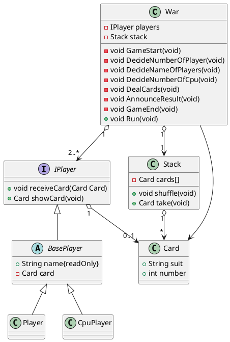

# クラス図

```plantuml
@startuml

class War {
  - IPlayer players
  - Stack stack
  - void GameStart(void)
  - void DecideNumberOfPlayer(void)
  - void DecideNameOfPlayers(void)
  - void DecideNumberOfCpu(void)
  - void DealCards(void)
  - void AnnounceResult(void)
  - void GameEnd(void)
  + void Run(void)
}
interface IPlayer {
  + void receiveCard(Card Card)
  + Card showCard(void)
}
abstract BasePlayer {
  + String name{readOnly}
  - Card card
}
class Player
class CpuPlayer
class Stack {
  - Card cards[]
  + void shuffle(void)
  + Card take(void)
}
class Card {
  + String suit
  + int number
}

War "1" o--> "1" Stack
War "1" o--> "2..*" IPlayer

BasePlayer -up-|> IPlayer
Player -up-|> BasePlayer
CpuPlayer -up-|> BasePlayer

Stack "1" o--> "*" Card
IPlayer "1" o--> "0..1" Card

War --> Card

@enduml
```
