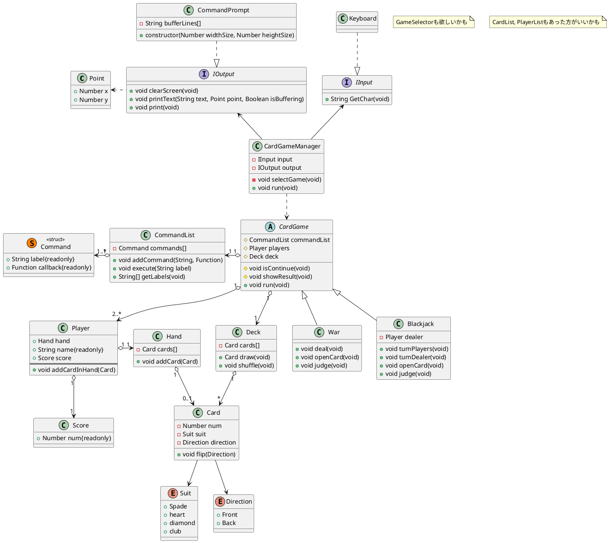

# クラス図

```plantuml
@startuml

class Point {
  + Number x
  + Number y
}

interface IInput {
  + String GetChar(void)
}
interface IOutput {
  + void clearScreen(void)
  + void printText(String text, Point point, Boolean isBuffering)
  + void print(void)
}
class Keyboard
class CommandPrompt {
  - String bufferLines[]
  + constructor(Number widthSize, Number heightSize)
}

IOutput .left.> Point
Keyboard ..|> IInput
CommandPrompt ..|> IOutput

'note "画面クラスも作らないとか？" as N2
note "GameSelectorも欲しいかも" as N3
note "CardList, PlayerListもあった方がいいかも" as N4

class CardGameManager {
  - IInput input
  - IOutput output
  - void selectGame(void)
  + void run(void)
}

class Command <<(S,#FF8000)struct>> {
  + String label{readonly}
  + Function callback{readonly}
}
class CommandList {
  - Command commands[]
  + void addCommand(String, Function)
  + void execute(String label)
  '+ CommandList pickList(String[] labels)
  + String[] getLabels(void)
}
CommandList "1" o-left-> "1..*" Command

abstract CardGame {
  # CommandList commandList
  # Player players
  # Deck deck
  # void isContinue(void)
  # void showResult(void)
  + void run(void)
}
class War {
  + void deal(void)
  + void openCard(void)
  + void judge(void)
}
class Blackjack {
  - Player dealer
  + void turnPlayers(void)
  + void turnDealer(void)
  + void openCard(void)
  + void judge(void)
}
class Deck {
  - Card cards[]
  + Card draw(void)
  + void shuffle(void)
}

War -up-|> CardGame
Blackjack -up-|> CardGame
CardGame "1" o--> "1" Deck

class Player {
  + Hand hand
  + String name{readonly}
  + Score score
  ===
  + void addCardInHand(Card)
}
class Hand {
  - Card cards[]
  + void addCard(Card)
}

Player "1" o-> "1" Hand

class Card {
  - Number num
  - Suit suit
  - Direction direction
  + void flip(Direction)
}
enum Suit {
  + Spade
  + heart
  + diamond
  + club
}
enum Direction {
  + Front
  + Back
}

Card --> Suit
Card --> Direction

class Score {
  + Number num{readonly}
}

CardGameManager -up-> IInput
CardGameManager -up-> IOutput
CardGameManager ..> CardGame

CardGame "1" o-left-> "1" CommandList
CardGame "1" o--> "2..*" Player
Deck "1" o--> "*" Card
Hand "1" o--> "0..1" Card
Player "1" o--> "1" Score
'Player.IPlayer ..>  Card.Card

@enduml
```
