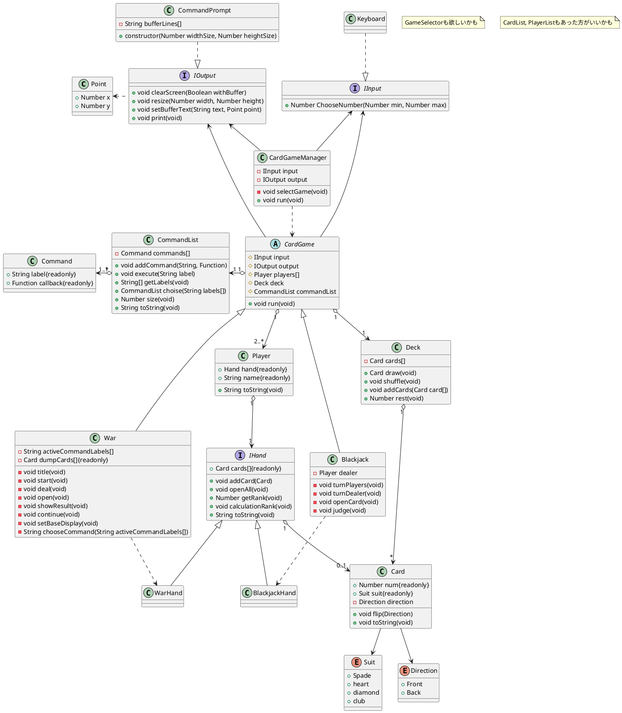

# クラス図

```plantuml
@startuml

class Point {
  + Number x
  + Number y
}

interface IInput {
  + Number ChooseNumber(Number min, Number max)
}
interface IOutput {
  + void clearScreen(Boolean withBuffer)
  + void resize(Number width, Number height)
  + void setBufferText(String text, Point point)
  + void print(void)
}
class Keyboard
class CommandPrompt {
  - String bufferLines[]
  + constructor(Number widthSize, Number heightSize)
}

IOutput .left.> Point
Keyboard ..|> IInput
CommandPrompt ..|> IOutput

'note "画面クラスも作らないとか？" as N2
note "GameSelectorも欲しいかも" as N3
note "CardList, PlayerListもあった方がいいかも" as N4

class CardGameManager {
  - IInput input
  - IOutput output
  - void selectGame(void)
  + void run(void)
}

class Command {
  + String label{readonly}
  + Function callback{readonly}
}
class CommandList {
  - Command commands[]
  + void addCommand(String, Function)
  + void execute(String label)
  + String[] getLabels(void)
  + CommandList choise(String labels[])
  + Number size(void)
  + String toString(void)
}
CommandList "1" o-left-> "1..*" Command

abstract CardGame {
  # IInput input
  # IOutput output
  # Player players[]
  # Deck deck
  # CommandList commandList
  + void run(void)
}
class War {
  - String activeCommandLabels[]
  - Card dumpCards[]{readonly}
  - void title(void)
  - void start(void)
  - void deal(void)
  - void open(void)
  - void showResult(void)
  - void continue(void)
  - void setBaseDisplay(void)
  - String chooseCommand(String activeCommandLabels[])
}
class Blackjack {
  - Player dealer
  - void turnPlayers(void)
  - void turnDealer(void)
  - void openCard(void)
  - void judge(void)
}
class Deck {
  - Card cards[]
  + Card draw(void)
  + void shuffle(void)
  + void addCards(Card card[])
  + Number rest(void)
}

War -up-|> CardGame
Blackjack -up-|> CardGame
CardGame "1" o--> "1" Deck

class Player {
  + Hand hand{readonly}
  + String name{readonly}
  + String toString(void)
}
interface IHand {
  + Card cards[]{readonly}
  + void addCard(Card)
  + void openAll(void)
  + Number getRank(void)
  + void calculationRank(void)
  + String toString(void)
}
class WarHand {
}
class BlackjackHand {
}

WarHand -up-|> IHand
BlackjackHand -up-|> IHand

Player "1" o--> "1" IHand

class Card {
  + Number num{readonly}
  + Suit suit{readonly}
  - Direction direction
  + void flip(Direction)
  + void toString(void)
}
enum Suit {
  + Spade
  + heart
  + diamond
  + club
}
enum Direction {
  + Front
  + Back
}

Card --> Suit
Card --> Direction

CardGameManager -up-> IInput
CardGameManager -up-> IOutput
CardGameManager ..> CardGame

CardGame -up-> IInput
CardGame -up-> IOutput
CardGame "1" o-left-> "1" CommandList
CardGame "1" o--> "2..*" Player

War ..> WarHand
Blackjack ..> BlackjackHand

Deck "1" o--> "*" Card
IHand "1" o--> "0..1" Card
'Player.IPlayer ..>  Card.Card

@enduml
```
