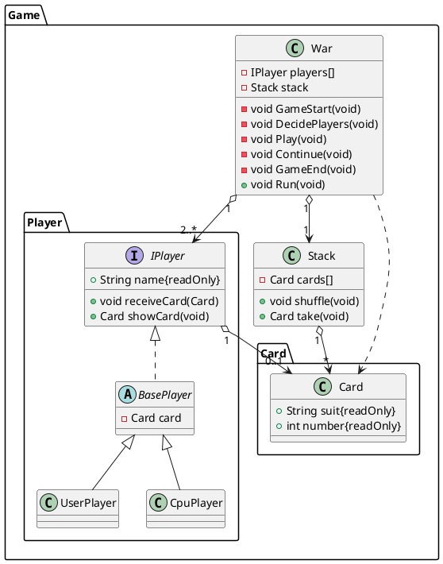

# クラス図

```plantuml
@startuml

namespace Game {
  class War {
    - IPlayer players[]
    - Stack stack
    - void GameStart(void)
    - void DecidePlayers(void)
    - void Play(void)
    - void Continue(void)
    - void GameEnd(void)
    + void Run(void)
  }

  namespace Player {
    interface IPlayer {
      + String name{readOnly}
      + void receiveCard(Card)
      + Card showCard(void)
    }
    abstract BasePlayer {
      - Card card
    }
    class UserPlayer
    class CpuPlayer
  }
  class Stack {
    - Card cards[]
    + void shuffle(void)
    + Card take(void)
  }
  namespace Card {
    class Card {
      + String suit{readOnly}
      + int number{readOnly}
    }
  }
}

Game.War "1" o--> "1" Game.Stack
Game.War "1" o--> "2..*" Game.Player.IPlayer

Game.Player.BasePlayer .up.|> Game.Player.IPlayer
Game.Player.UserPlayer -up-|> Game.Player.BasePlayer
Game.Player.CpuPlayer -up-|> Game.Player.BasePlayer

Game.Stack "1" o--> "*" Game.Card.Card
Game.Player.IPlayer "1" o--> "0..1" Game.Card.Card

Game.War ..> Game.Card.Card

@enduml
```
