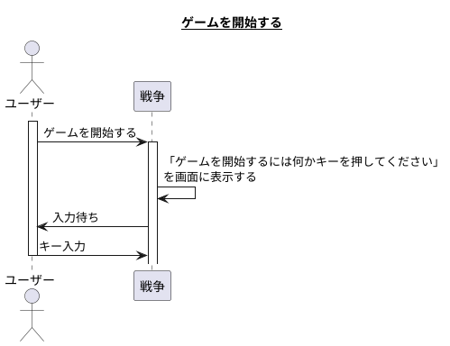
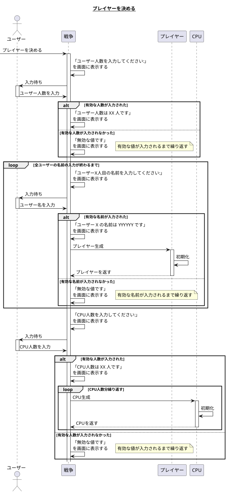
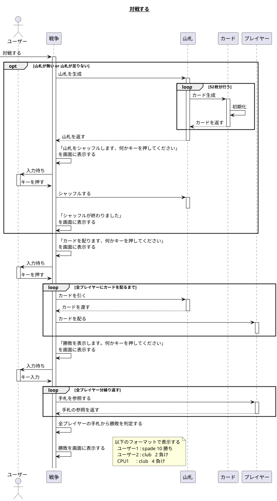
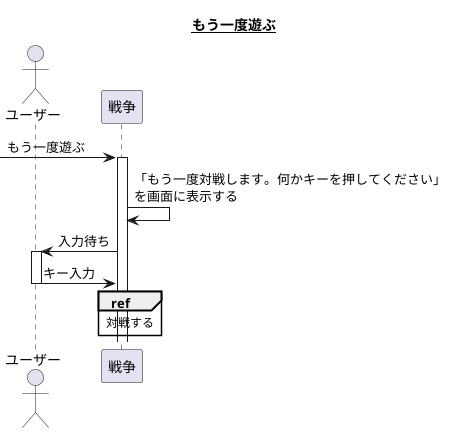
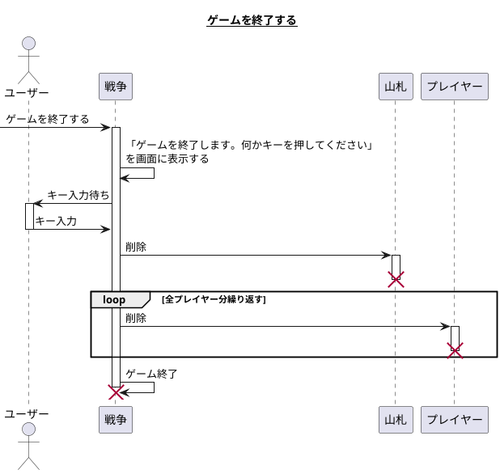

# シーケンス図

```plantuml
@startuml

title __ゲームを開始する__

actor ユーザー
activate ユーザー

ユーザー -> 戦争 : ゲームを開始する
activate 戦争

戦争 -> 戦争 : 「ゲームを開始するには何かキーを押してください」\nを画面に表示する
ユーザー <- 戦争 : 入力待ち
ユーザー -> 戦争 : キー入力
deactivate ユーザー

@enduml
```

```plantuml
@startuml

title __プレイヤーを決める__

actor ユーザー

[-> 戦争 : プレイヤーを決める
activate 戦争

戦争 -> 戦争 : 「ユーザー人数を入力してください:」\nを画面に表示する
ユーザー <- 戦争 : 入力待ち
activate ユーザー
ユーザー -> 戦争 : ユーザー人数を入力
deactivate ユーザー
alt 有効な人数が入力された
  戦争 -> 戦争 : 「ユーザー人数は XX 人です」\nを画面に表示する
else 有効な人数が入力されなかった
  戦争 -> 戦争 : 「無効な値です」\nを画面に表示する
  note right
    有効な値が入力されるまで繰り返す
  end note
end

loop 全ユーザーの名前の入力が終わるまで
  戦争 -> 戦争 : 「ユーザーX人目の名前を入力してください:」\nを画面に表示する
  ユーザー <- 戦争 : 入力待ち
  activate ユーザー
  ユーザー -> 戦争 : ユーザー名を入力
  deactivate ユーザー
  alt 有効な名前が入力された
    戦争 -> 戦争 : 「ユーザー X の名前は YYYYYY です」\nを画面に表示する
    戦争 -> プレイヤー : プレイヤー生成
    activate プレイヤー
    プレイヤー -> プレイヤー : 初期化
    戦争 <-- プレイヤー : プレイヤーを返す
    deactivate プレイヤー
  else 有効な名前が入力されなかった
    戦争 -> 戦争 : 「無効な値です」\nを画面に表示する
    note right
      有効な名前が入力されるまで繰り返す
    end note
  end
end

戦争 -> 戦争 : 「CPU人数を入力してください:」\nを画面に表示する
ユーザー <- 戦争 : 入力待ち
activate ユーザー
ユーザー -> 戦争 : CPU人数を入力
deactivate ユーザー
alt 有効な人数が入力された
  戦争 -> 戦争 : 「CPU人数は XX 人です」\nを画面に表示する
  loop CPU人数分繰り返す
    戦争 -> CPU : CPU生成
    activate CPU
    CPU -> CPU : 初期化
    戦争 <-- CPU : CPUを返す
    deactivate CPU
  end
else 有効な人数が入力されなかった
  戦争 -> 戦争 : 「無効な値です」\nを画面に表示する
  note right
    有効な値が入力されるまで繰り返す
  end note
end

@enduml
```

```plantuml
@startuml

title __対戦する__

actor ユーザー

[-> 戦争 : 対戦する
activate 戦争

opt 山札が無い or 山札が足りない
  戦争 -> 山札 : 山札を生成
  activate 山札
  loop 52枚分行う
    山札 -> カード : カード生成
    activate カード
    カード -> カード : 初期化
    山札 <-- カード : カードを返す
    deactivate カード
  end
  戦争 <-- 山札 : 山札を返す
  deactivate 山札

  戦争 -> 戦争 : 「山札をシャッフルします、何かキーを押してください」\nを画面に表示する
  ユーザー <- 戦争 : 入力待ち
  activate ユーザー
  ユーザー -> 戦争 : キーを押す
  deactivate ユーザー

  戦争 -> 山札 : シャッフルする
  activate 山札
  deactivate 山札

  戦争 -> 戦争 : 「シャッフルが終わりました」\nを画面に表示する
end

戦争 -> 戦争 : 「カードを配ります、何かキーを押してください」\nを画面に表示する
ユーザー <- 戦争 : 入力待ち
activate ユーザー
ユーザー -> 戦争 : キーを押す
deactivate ユーザー

loop 全プレイヤーにカードを配るまで

  戦争 -> 山札 : カードを引く
  activate 山札
  戦争 <-- 山札 : カードを渡す
  deactivate 山札
  戦争 -> プレイヤー : カードを配る
  activate プレイヤー
  deactivate プレイヤー
end

activate 戦争
戦争 -> 戦争 : 「勝敗を表示します。何かキーを押してください」\nを画面に表示する
ユーザー <- 戦争 : 入力待ち
activate ユーザー
ユーザー -> 戦争 : キー入力
deactivate ユーザー

loop 全プレイヤー分繰り返す
  戦争 -> プレイヤー : 手札を参照する
  activate プレイヤー
  戦争 <-- プレイヤー : 手札の参照を返す
  deactivate プレイヤー
end

戦争 -> 戦争 : 全プレイヤーの手札から勝敗を判定する
戦争 -> 戦争 : 勝敗を画面に表示する
note right
  以下のフォーマットで表示する
    ユーザー1 : spade 10 勝ち
    ユーザー2 : club   2 負け
    CPU1      : club   4 負け
end note

@enduml
```

```plantuml
@startuml

title __もう一度遊ぶ__

actor ユーザー

[-> 戦争 : もう一度遊ぶ

activate 戦争
戦争 -> 戦争 : 「もう一度対戦します。何かキーを押してください」\nを画面に表示する
ユーザー <- 戦争 : 入力待ち
activate ユーザー
ユーザー -> 戦争 : キー入力
deactivate ユーザー

ref over 戦争
  対戦する
end

@enduml
```

```plantuml
@startuml

title __ゲームを終了する__

actor ユーザー

[-> 戦争 : ゲームを終了する
activate 戦争
戦争 -> 戦争 : 「ゲームを終了します。何かキーを押してください」\nを画面に表示する
ユーザー <- 戦争 : キー入力待ち
activate ユーザー
ユーザー -> 戦争 : キー入力
deactivate ユーザー


戦争 -> 山札 : 削除
activate 山札
destroy 山札

loop 全プレイヤー分繰り返す
  戦争 -> プレイヤー : 削除
  activate プレイヤー
  destroy プレイヤー
end

戦争 -> 戦争 : ゲーム終了
destroy 戦争

@enduml
```
