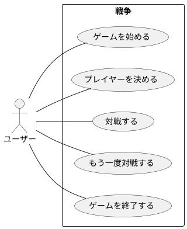

# ユースケース

|     名称     |                                    ゲームを始める                                     |
| ------------ | ------------------------------------------------------------------------------------- |
| 能動アクター | ユーザー                                                                              |
| 受動アクター | なし                                                                                  |
| メインフロー | 1. システム: 「ゲームを開始するには何かキーを押してください」と表示し入力待ちにする。 |
|              | 2. ユーザー: 何かキーを押す。                                                         |
| 例外フロー   | なし                                                                                  |

|     名称     |                               プレイヤーを決める                                |
| ------------ | ------------------------------------------------------------------------------- |
| 能動アクター | ユーザー                                                                        |
| 受動アクター | なし                                                                            |
| メインフロー | 1. システム: 「プレイヤー情報を入力してください」と表示する。                   |
|              | 2. システム: 「ユーザー人数を入力してください:」と表示し入力待ちにする。        |
|              | 3. ユーザー: ユーザー人数を入力する。                                           |
|              | 4. システム: 「ユーザー人数は XX 人です」とメッセージを表示する。               |
|              | 5. システム: 「ユーザーX人目の名前を入力してください:」と表示し入力待ちにする。 |
|              | 6. ユーザー: ユーザー名を入力する。                                             |
|              | 7. システム: 「ユーザーX人目の名前は YYYYYY です」とメッセージを表示する。      |
|              | 8. システム:  ユーザー人数分5-7を繰り返す。                                     |
|              | 9. システム: 「CPU数を入力してください:」と表示し入力待ちにする。               |
|              | 10. ユーザー: CPU数を入力する。                                                 |
|              | 11. システム: 「CPU数は XX 人です」と表示する。                                 |
|              | 12. システム: プレイヤー一覧を表示する。                                        |
| 例外フロー   | 入力値が不正な場合は「無効な値です」と表示し再入力させる。                      |

|     名称     |                                           対戦する                                           |
| ------------ | -------------------------------------------------------------------------------------------- |
| 能動アクター | ユーザー                                                                                     |
| 受動アクター | なし                                                                                         |
| メインフロー | 1. システム: 「対戦を開始します」と表示する。                                                |
|              | 2. システム: 山札が無ければ用意する。                                                        |
|              | 3. システム: 「山札の準備が出来ました」と表示し入力待ちにする。                              |
|              | 4. ユーザー: 何かキーを押す。                                                                |
|              | 5. システム: 「カードを配ります、何かキーを押してください」と表示し入力待ちにする。          |
|              | 6. ユーザー: 何かキーを押す。                                                                |
|              | 7. システム: プレイヤー全員に1枚ずつカードを配る。                                           |
|              | 8. システム: 「勝敗を表示します。何かキーを押してください」と表示し入力待ちにする。          |
|              | 9. ユーザー: 何かキーを押す。                                                                |
|              | 10. システム: プレイヤー全員の手札から勝敗を判定する。                                        |
|              | 11. システム: 「プレイヤー名 : マーク 数値 [勝ち or 負け]」の表示を全プレイヤー分を表示する。 |
| 例外フロー   | なし                                                                                         |

|     名称     |                      もう一度対戦する                       |
| ------------ | ----------------------------------------------------------- |
| 能動アクター | ユーザー                                                    |
| 受動アクター | なし                                                        |
| メインフロー | 1. システム: 「もう一度対戦します」と表示し入力待ちにする。 |
|              | 2. システム: 対戦する を実行する。                          |
| 例外フロー   | なし                                                        |

|     名称     |                                         ゲームを終了する                                          |
| ------------ | ------------------------------------------------------------------------------------------------- |
| 能動アクター | ユーザー                                                                                          |
| 受動アクター | なし                                                                                              |
| メインフロー | 1. システム: 「ゲームを終了します。何かキーを押してください」とメッセージを表示し入力待ちにする。 |
|              | 2. ユーザー: 何かキーを押す。                                                                     |
|              | 3. システム: プログラムを終了する                                                                 |
| 例外フロー   | なし                                                                                              |
