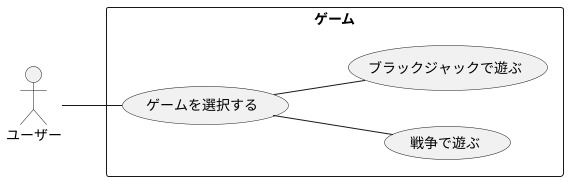

# ユースケース

|     名称     |                               ゲームを選択                               |
| ------------ | ------------------------------------------------------------------------ |
| 能動アクター | ユーザー                                                                 |
| 受動アクター | なし                                                                     |
| メインフロー | 1. システム: ゲーム選択画面を描画する。                                  |
|              | 1-1. システム: 「遊ぶゲームを選択してください」と表示する。              |
|              | 1-2. システム: 「1: 戦争, 2: ブラックジャック:」と表示し入力待ちにする。 |
|              | 2. ユーザー: キーを入力してゲームを選択する                              |
| 例外フロー   | 選択肢に無い入力した場合は1からやり直す。                                |

|     名称     |            戦争で遊ぶ             |
| ------------ | --------------------------------- |
| 能動アクター | ユーザー                          |
| 受動アクター | なし                              |
| メインフロー | 1. システム: 戦争画面を描画する。 |
|              | 2. システム: 戦争を開始する。     |
|              | 3. ユーザー: 戦争で遊ぶ。         |
| 例外フロー   | なし                              |

|     名称     |            ブラックジャックで遊ぶ             |
| ------------ | --------------------------------------------- |
| 能動アクター | ユーザー                                      |
| 受動アクター | なし                                          |
| メインフロー | 1. システム: ブラックジャック画面を描画する。 |
|              | 2. システム: ブラックジャックを開始する。     |
|              | 3. ユーザー: ブラックジャックで遊ぶ。         |
| 例外フロー   | なし                                          |
