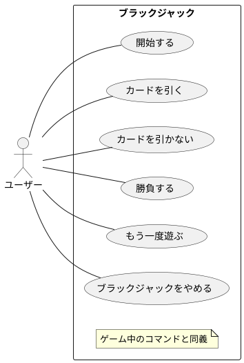

# ユースケース ブラックジャック

|     名称     |                               開始する                               |
| ------------ | -------------------------------------------------------------------- |
| 能動アクター | ユーザー                                                             |
| 受動アクター | なし                                                                 |
| メインフロー | 1. ユーザー: 「開始する」コマンドを選択する。                        |
|              | 2. システム: 山札を用意しシャッフルする。                            |
|              | 3. システム: ディーラーと全プレイヤーにカードを表向きで1枚ずつ配る。 |
|              | 3. システム: 全プレイヤーにカードを表向きで1枚ずつ配る。             |
|              | 3. システム: ディーラーにカードを裏向きで1枚ずつ配る。               |
| 例外フロー   | なし                                                                 |

|     名称     |                    カードを引く                    |
| ------------ | -------------------------------------------------- |
| 能動アクター | ユーザー                                           |
| 受動アクター | なし                                               |
| メインフロー | 1. ユーザー: 「カードを引く」コマンドを選択する。  |
|              | 2. システム: プレイヤーにカードを表向きで1枚配る。 |
| 例外フロー   | なし                                               |

|     名称     |                         カードを引かない                          |
| ------------ | ----------------------------------------------------------------- |
| 能動アクター | ユーザー                                                          |
| 受動アクター | なし                                                              |
| メインフロー | 1. ユーザー: 「カードを引かない」コマンドを選択する。             |
|              | 2. システム: ディーラーを手札が17以上になるまでカードを引かせる。 |
| 例外フロー   | なし                                                              |

|     名称     |                          勝負する                           |
| ------------ | ----------------------------------------------------------- |
| 能動アクター | ユーザー                                                    |
| 受動アクター | なし                                                        |
| メインフロー | 1. ユーザー: 「勝負する」コマンドを選択する。               |
|              | 2. システム: ディーラーのカードを表向きにする。             |
|              | 2. システム: ディーラーと各プレイヤー同士で勝敗を判定する。 |
|              | 2. システム: 全プレイヤーの勝敗を描画する。                 |
| 例外フロー   | なし                                                        |

|     名称     |                    もう一度遊ぶ                     |
| ------------ | --------------------------------------------------- |
| 能動アクター | ユーザー                                            |
| 受動アクター | なし                                                |
| メインフロー | 1. ユーザー: 「もう一度遊ぶ」コマンドを選択する。   |
|              | 2. システム: 「開始する」コマンドと同じことをする。 |
| 例外フロー   | なし                                                |
