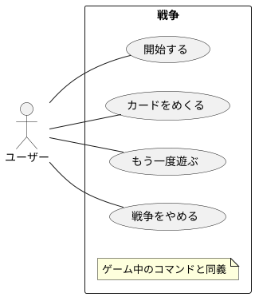

# ユースケース 戦争

|     名称     |                        開始する                        |
| ------------ | ------------------------------------------------------ |
| 能動アクター | ユーザー                                               |
| 受動アクター | なし                                                   |
| メインフロー | 1. ユーザー: 「開始する」コマンドを選択する。          |
|              | 2. システム: 山札が無ければ用意しシャッフルする。      |
|              | 3. システム: 全プレイヤーカードを裏向きで1枚ずつ配る。 |
| 例外フロー   | なし                                                   |

|     名称     |                   カードをめくる                    |
| ------------ | --------------------------------------------------- |
| 能動アクター | ユーザー                                            |
| 受動アクター | なし                                                |
| メインフロー | 1. ユーザー: 「カードをめくる」コマンドを選択する。 |
|              | 2. システム: 全プレイヤーカードを表向きにする。     |
|              | 3. システム: 勝敗を判定する。                       |
|              | 4. システム: 勝敗を画面に描画する。                 |
| 例外フロー   | なし                                                |

|     名称     |                    もう一度遊ぶ                     |
| ------------ | --------------------------------------------------- |
| 能動アクター | ユーザー                                            |
| 受動アクター | なし                                                |
| メインフロー | 1. ユーザー: 「もう一度遊ぶ」コマンドを選択する。   |
|              | 2. システム: 「開始する」コマンドと同じことをする。 |
| 例外フロー   | なし                                                |
